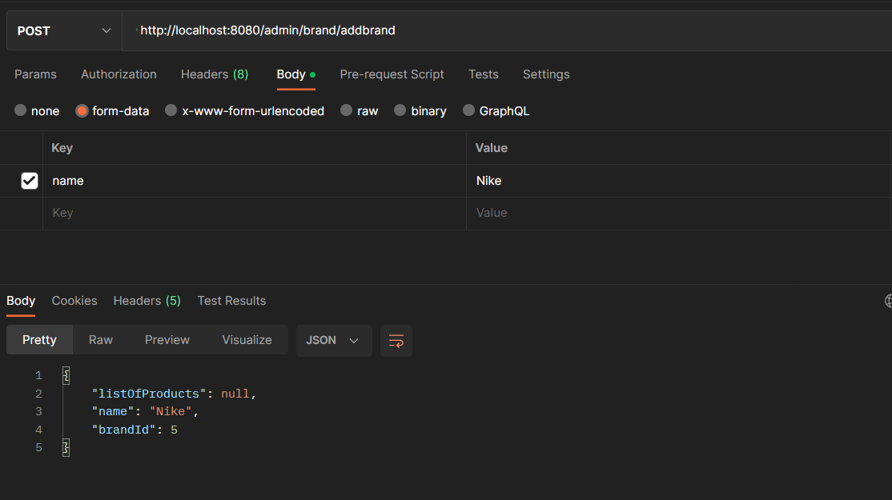
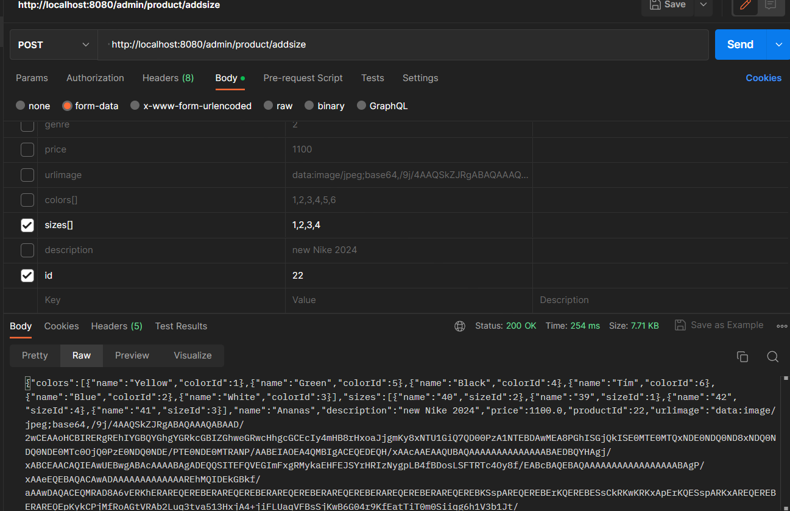

### Đây là bài giữa kỳ môn công nghệ JAVA
Các thành phần của project 

    File Shoe chứa source code để chạy chương trình
    File database chứa file sql của chương trình, mô hình quan hệ , mô hình erd của chương trình
Sau đây là hướng dẫn để có thể chạy chương trình 
1. Cần thiết lập database trong website này được thực hiện bằng mysql 
   1. Tạo một database tên là shoe sau đó import file sql được lưu ở thư mục database
   2. Sau đó thiết lập kết nối với database trong file application.properties
2. Download project về máy và chạy chương trình 

*Lưu ý*: trong project này em sử dụng java 17 hãy đảm bảo rằng máy của bạn có nó.

Mô tả về Website :

    Website sử dụng templates free của https://colorlib.com/

    Website chỉ có giao diện tương tác giữa khách hàng và server 
    Website có phần font-end cho phía khách hàng.
    Các chức năng chính của Web cho là:
        Ở phía khách hàng
            - Trang chủ hiện thị thông tin sản phẩm cho khách hàng 
            - Search sản phẩm 
            - Liệt kê sản phẩm theo từng loại sản phẩm
            - Xem chi tiết sản phẩm 
            - Liệt kê sản phẩm theo loại sản phẩm và theo hãng
            - Khách hàng có thể thêm sản phẩm vào giỏ hàng, đặt hàng, xem giỏ hàng, xem lịch sử đặt hàng, tình trạng đơn hàng.
            - Đăng nhập và đăng ký cho khách hàng
        Ở phía admin 
            - Có thể xem các đơn đặt hàng của khách hàng , thay đổi trạng thái của đơn hàng.
            - CRUD loại sản phẩm, hãng sản phẩm, sản phẩm,màu của sản phẩm,size sản phẩm
Dưới đây là lệnh và ảnh chụp  ví dụ của postman về việc request các api
----------------------------------------------------------------

### CRUD  Brand:
    
- Lấy tất cả thông tin của brand
     
     - url: GET http://localhost:8080/admin/brand/getAll
    
     - ảnh chụp:

     
-  Lấy thông tin của một brand theo id
    
    - url :GET http://localhost:8080/admin/brand/getBrand/{id}

    trong đó {id} là id của brand

   -  ảnh chụp  ví dụ :
    

- Thêm một brand vào database 
   -  url : POST http://localhost:8080/admin/brand/addbrand 

   - ảnh chụp:
  
  *Lưu ý:* Việc đặt tên biến phải giống với tên biến như trong hình thì mới có thể thực hiện request 
-   Update brand  
    - url : POST  http://localhost:8080/admin/brand/updateBrand
    - ảnh chụp
    
- Delete brand 
  - url : DELETE http://localhost:8080/admin/brand/deleteBrand/{id}
   trong đó {id} là id của brand
   - ảnh chụp:
   
   *Lưu ý:* Việc xóa brand sẽ đồng nghĩa với việc xóa luôn các sản phẩm thuộc brand đó
   ----------------------------------------------------------------

### CRUD Genre 
- Lấy tất cả thông tin của genre
  - url : GET http://localhost:8080/admin/genre/getAll
  - ảnh chụp
    
- Lấy thông tin của một genre
  - url : GET http://localhost:8080/admin/genre/getGenre/{id}
  trong đó {id} là id của genre
  - ảnh chụp
  
- Thêm một genre vào database
    - url : POST http://localhost:8080/genre/addGenre
    - ảnh chụp  ví dụ 
    
- Cập nhật thông tin của một genre
    - url : POST http://localhost:8080/admin/genre/updateGenre
    - ảnh chụp
    
- Xóa một genre trong database
     - url : DELETE http://localhost:8080/admin/genre/deleteGenre/{id} trong đó {id }là id của genre 
    - ảnh chụp  ví dụ 
    
    ----------------------------------------------------------------

### CRUD color
- Lấy thông tin của tất cả các color
    - url : GET http://localhost:8080/admin/color/getAll
    - ảnh chụp  ví dụ 
    

- Lấy thông tin của một color
    - url : GET http://localhost:8080/admin/color/getColor/{id} trong đó id là id của color
    - ảnh chụp  ví dụ 
    
- Thêm một color
  - url : POST http://localhost:8080/admin/color/addColor
  - ảnh chụp  ví dụ 
  
- Cập nhật thông tin của Color
  - url: POST http://localhost:8080/admin/color/updateColor
  - ảnh chụp  ví dụ 
  
- Xóa một Color
  - url: DELETE http://localhost:8080/admin/color/deleteColor/{id} trong đó id là id của Color
  - ảnh chụp  ví dụ 
  
------------------------------------------------------------------------------------------------
### CRUD Size
- Lấy thông tin của tất cả các size
    - url : GET http://localhost:8080/admin/Size/getAll
    - ảnh chụp  ví dụ 
    

- Lấy thông tin của một color
    - url : GET http://localhost:8080/admin/Size/getSize/{id} trong đó id là id của Size
    - ảnh chụp  ví dụ 
    
- Thêm một color
  - url : POST http://localhost:8080/admin/Size/addSize
  - ảnh chụp  ví dụ 
  
- Cập nhật thông tin của Size
  - url: POST http://localhost:8080/admin/Size/updateSize
  - ảnh chụp  ví dụ 
  
- Xóa một Size
  - url: DELETE http://localhost:8080/admin/Size/deleteSize/{id} trong đó id là id của Size
  - ảnh chụp  ví dụ 
  
----------------------------------------------------------------
### CRUD ORDER
- Lấy thông tin của tất cả các đơn hàng
  - url : GET http://localhost:8080/admin/order/getAll
  - ảnh chụp  ví dụ 
    
- Lấy thông tin của một đơn hàng 
  - url : GET http://localhost:8080/admin/order/getDetailOrder/{id} trong đó {id} là id của đơn hàng 
  - ảnh chụp  ví dụ 
  
- Thay đổi trạng thái của đơn hàng
  - url : POST http://localhost:8080/admin/order/changeStatus
  - ảnh chụp  ví dụ 
  
- Xóa đơn hàng 
   - url : DELETE  http://localhost:8080/admin/order/deleteOrder/{id} trong đó {id} là id của đơn hàng 
    -   ảnh chụp
     
- Cập nhật thông tin đơn hàng 
 - url  POST : http://localhost:8080/admin/order/updateOrder
 - ảnh chụp  ví dụ 
   

------
### CRUD product
- Lấy thông tin của tất cả sản phẩm 
  - url GET : http://localhost:8080/admin/product/getAll
  - ảnh chụp  ví dụ 
  -  
- Lấy thông tin chi tiết của một sản phẩm 
  - url GET http://localhost:8080/admin/product/getProductByID/{id} trong đó {id} là id của sản phẩm 
  - ảnh chụp  ví dụ 
  
- Thêm một sản phẩm vào database
  - url POST  http://localhost:8080/admin/product/addProduct
  - ảnh chụp  ví dụ 
  - 
- cập nhật thông tin  một sản phẩm 
  - url POST  http://localhost:8080/admin/product/updateUpdate
  - ảnh chụp  ví dụ 
  - 
- Xóa một sản phẩm 
  - Url DELETE  http://localhost:8080/admin/product/deleteProduct/{id} trong đó id là mã của sản phẩm 
  - ảnh chụp
   
- Thêm một color vào sản phẩm 
    - url POST http://localhost:8080/admin/product/addColor
    - ảnh chụp  ví dụ 
    
- Thêm một size vào sản phẩm 
    - url POST http://localhost:8080/admin/product/addsize
    - ảnh chụp  ví dụ 
    
